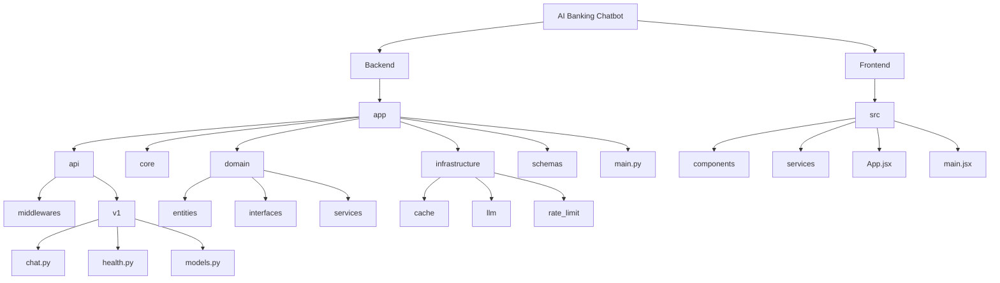

# 🤖 AI Banking Assistant

## Production-ready AI-powered banking chatbot with LLM, RAG, and API integration

[](https://python.org)
[](https://fastapi.tiangolo.com)
[](https://reactjs.org)
[](https://huggingface.co)

---

## 📚 Table of Contents

* [Overview](#overview)
* [Tech Stack](#tech-stack)
* [Features](#features)
* [Project Structure](#project-structure)
* [Installation](#installation)
* [Running the Application](#running-the-application)
* [API Documentation](#api-documentation)
* [Future Improvements](#future-improvements)

---

## 📌 Overview

The **AI Banking Assistant** is a full-stack application that enables intelligent conversations for banking operations using LLMs and RAG.

### 🚀 Key Capabilities

* Natural language conversations
* Document-based Q&A (RAG)
* API integration
* Chat memory & context
* Scalable backend architecture

---

## 🛠 Tech Stack

### Backend

* Python 3.11
* FastAPI
* Hugging Face Transformers
* PyTorch

### Frontend

* React
* Vite
* Axios

### Infrastructure

* Docker
* Redis (optional)
* PostgreSQL (planned)
* FAISS / Chroma (planned)

---

## ✨ Features

### ✅ Completed

* FastAPI backend
* LLM integration
* Chat UI (React)
* Streaming responses
* Rate limiting + caching

### 🚧 In Progress

* RAG pipeline
* Vector DB
* Authentication
* Deployment

---

## 🗂 Project Structure (Mermaid Diagram)



---

## ⚙️ Installation

### Prerequisites

* Python 3.11+
* Node.js 18+
* Git

---

### 🔧 Backend Setup

```bash
git clone https://github.com/yourusername/ai-banking-chatbot.git
cd ai-banking-chatbot/backend

python -m venv venv
venv\Scripts\activate

pip install -r requirements.txt
uvicorn app.main:app --reload
```

---

### 💻 Frontend Setup

```bash
cd frontend
npm install
npm run dev
```

---

## ▶️ Running the Application

* Backend → http://localhost:8000
* Frontend → http://localhost:5173

---

## 📡 API Documentation

* Swagger → http://localhost:8000/docs
* ReDoc → http://localhost:8000/redoc

---

## 🚀 Future Improvements

* Full RAG system
* Authentication (JWT)
* Chat history persistence
* Docker deployment
* Model optimization

---

## 📄 License

For educational and portfolio use.
